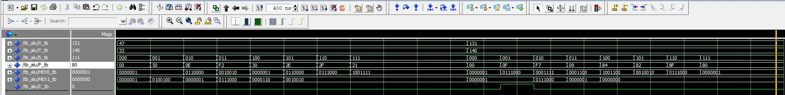
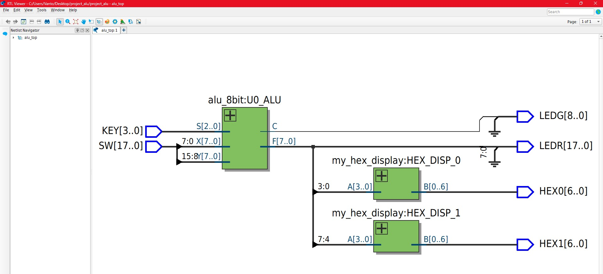
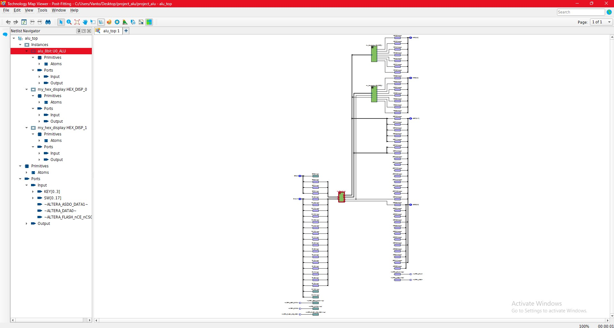

# 8-bit ALU Design in VHDL

This repository contains the design, implementation, and simulation of an 8-bit Arithmetic Logic Unit (ALU), written entirely in VHDL. The design supports 8 distinct operations controlled by a 3-bit selection signal (`S`) and includes a module for driving 7-segment displays (Hex) to visualize the output.

## 🚀 Features & Operations

The ALU handles 8-bit operations using 2's complement arithmetic, includes carry/overflow management, and outputs the result in hexadecimal format. The operations are selected via the 3-bit `S` signal according to the following truth table:

| Select (S) | Operation | Description |
| :---: | :---: | :--- |
| `000` | F = 0 | Clear/Zero output |
| `001` | F = X + Y | Addition (with carry/overflow detection) |
| `010` | F = X - Y | Subtraction (X - Y) |
| `011` | F = Y - X | Subtraction (Y - X) |
| `100` | F = X + 1 | Increment X by 1 |
| `101` | F = X - 1 | Decrement X by 1 |
| `110` | F = X OR Y | Bitwise OR |
| `111` | F = X AND Y | Bitwise AND |

## 📁 Repository Structure

- `/src`: Contains the VHDL source files (Top-level architecture, 8-bit ALU core, Hex display decoder, and Utility packages).
- `/sim`: Contains the Testbench (`tb_alu.vhd`) for functional verification.
- `/quartus`: Intel Quartus Prime project configuration files (QPF, QSF) and Pin Assignments for the DE2-115 development board.
- `/assets`: Contains screenshots of the RTL schematic, technology map, and simulation waveforms.

## 🛠️ Tools Used

- **Hardware Description Language:** VHDL
- **Synthesis & Routing:** Intel Quartus Prime
- **Simulation:** ModelSim

---

## 📊 Simulation & Waveform Analysis

The design was thoroughly tested using a testbench in ModelSim. Below is the waveform output demonstrating the functionality of the ALU across various operations.

**Signal Description:**
- `X_tb` & `Y_tb`: 8-bit inputs (displayed in decimal).
- `S_tb`: 3-bit operation selector (displayed in binary).
- `F_tb`: 8-bit output result (displayed in hexadecimal).
- `C_tb`: Carry/Overflow bit (binary).
- `HEX0_tb` & `HEX1_tb`: 7-segment display driving signals mapping the two 4-bit nibbles of `F_tb`.

### Test Case 1: Standard Operations
**Inputs:** `X = 47` (Binary: 00101111, Hex: 2F), `Y = 33` (Binary: 00100001, Hex: 21)

1. **S = 000 (Clear):** Output is zeroed. `F = 00`, `C = 0`.
2. **S = 001 (Addition X+Y):** Adding 00101111 + 00100001 results in `F = 01010000` (50 Hex). No 8-bit overflow occurs, so `C = 0`.
3. **S = 010 (Subtraction X-Y):** Subtracting 33 from 47. Result is `F = 00001110` (0E Hex), `C = 0`.
4. **S = 011 (Subtraction Y-X):** Subtracting a larger number (47) from a smaller one (33). Due to 2's complement arithmetic, the result wraps around to `F = 11110010` (F2 Hex), `C = 0`.
5. **S = 100 (Increment X):** Adding 1 to 00101111. The last four bits (1111) become 0000 and carry over, resulting in `F = 00110000` (30 Hex), `C = 0`.
6. **S = 101 (Decrement X):** Subtracting 1 from 00101111. The least significant bit flips to 0, yielding `F = 00101110` (2E Hex), `C = 0`.
7. **S = 110 (Bitwise OR):** Since the bits of X cover all the active bits of Y, the result mirrors X: `F = 00101111` (2F Hex), `C = 0`.
8. **S = 111 (Bitwise AND):** Retains 1s only where both inputs have 1s. Result is `F = 00100001` (21 Hex), `C = 0`.

### Test Case 2: Overflow Detection
**Inputs:** `X = 131` (Binary: 10000011, Hex: 83), `Y = 140` (Binary: 10001100, Hex: 8C)

- **S = 001 (Addition X+Y):** The mathematical sum is 131 + 140 = 271. This value exceeds the maximum 8-bit unsigned limit (255), causing an overflow. The binary addition yields `F = 00001111` (0F Hex), and the 9th bit generated triggers the carry out flag, resulting in **`C = 1`**.

---

## 🖥️ RTL & Technology Map Viewer

The design was synthesized in Quartus Prime. Below are the visual representations of the synthesized hardware.

### RTL Viewer
Shows the top-level entity integrating the ALU core and the dual 7-segment hex display decoders.

### Technology Map Viewer (Post-Fitting)
Displays how the abstract logic is mapped to the physical Look-Up Tables (LUTs) and logic elements of the target FPGA.
